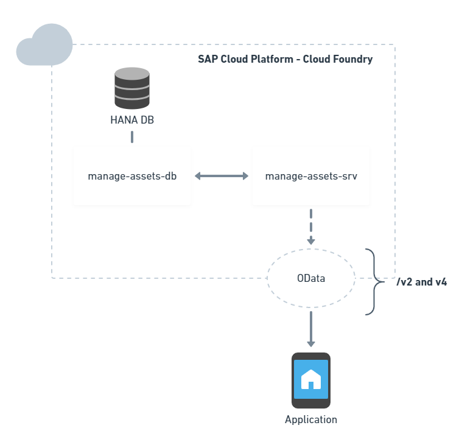

# manage-digital-assets
Manage Digital Assets using Node.js

* [Environment config](#environment-config)
* [Understanding the project structure](#understanding-the-project-structure)
  - [Install dependencies](#install-dependencies)
* [Project Overview](#project-overview)
* [Run the project in CF](#run-the-project-in-cf)
  - [Connect to your CF account](#connect-to-your-cf-account)
  - [Create a HANA Service in CF](#create-a-hana-service-in-cf)
  - [Run service locally](#run-service-locally)
  - [Build and Deploy](#build-and-deploy)
  - [Run Run Run](#run-run-run)

## Environment config

- Well... start by installing [Node.js](https://nodejs.org/en/) 😅.

- Signup for hana trial cloud foundry account in [hanatrial](https://cockpit.eu10.hana.ondemand.com/trial/#/home/trial) 

- Download and install the cds plugin for `vscode` at [sap#vscode-cds-plugin](https://tools.hana.ondemand.com/#cloud-vscodecds)

- Download the latest command line interface `cli` from the Cloud Foundry at https://github.com/cloudfoundry/cli#downloads

```bash
npm set @sap:registry=https://npm.sap.com`
```

- Install `cds-dk` globally for cds support.

```bash
npm i -g @sap/cds-dk
```

- Install the UI5 `cli` globally

```bash
npm install --global @ui5/cli
```

- Install the SAPUI5 template generator globally

```bash
npm install -g yo @sapui5/generator-sapui5-templates
```


## Understanding the project structure 

File or Folder | Purpose
---------------|----------
`app/`         | content for UI frontends
`db/`          | cds domain models and data
`srv/`         | cds service models and code

_refer to the base path:_ `packages/assets`


#### Install dependencies 

Install the database and services dependecies.

```
cd packages/assets
npm install
```

and finally the app

```
cd packages/assets/app/assets
npm install
```

now we're done to get really started.


## Project Overview

Project consist in having application deployed in Cloud Foundry, and exposes the service layer through a route. The odata can be accessed, and a fiori representation can be called in order to display it on web.

<div style="text-align:center">



</div>


## Run the project in CF

#### Connect to your CF account

- Login to Cloud Foundry environment by executing the statement below. Make sure you have configured the right CF api endpoint at the file. Enter your password when prompted.

``` windows
# windows
cf_login.bat

# unix
cf_login.sh
```
Once you are logged, you should see the your API endpoint, user, organisation, and space.

- Add the SAP HANA driver and client into your project

```bash
npm add hana
```

Adjust the `package.json` at `packages/assets/` folder by changing the `db.kind` to `hana`

```json
...
  "db": {
    "kind": "hana"
  }
...
```


#### Create a HANA Service in CF

```
cf create-service hanatrial hdi-shared ${APPLICATION_NAME}-hdi-container
```


# Run service locally

At `package/assets` dir, run `cds check`. The service should now be available at `http://localhost:4004/v2/catalog`. You're now able to move to the next step 🙌


#### Build and Deploy

Now that the service is create, you're now able to bind apps to the newly service.

```
cds build
cf push -f gen/db

#--random-route (optional)
cf push -f gen/srv 
```

Once it get finished, use `cf apps` to check whether application is running and which route is assigned with.


#### Run Run Run 

🐤🚗🚙🚗🚜

Access your CF account, more precisely the `dev` space, and access the `assets-srv` app to get the application route.